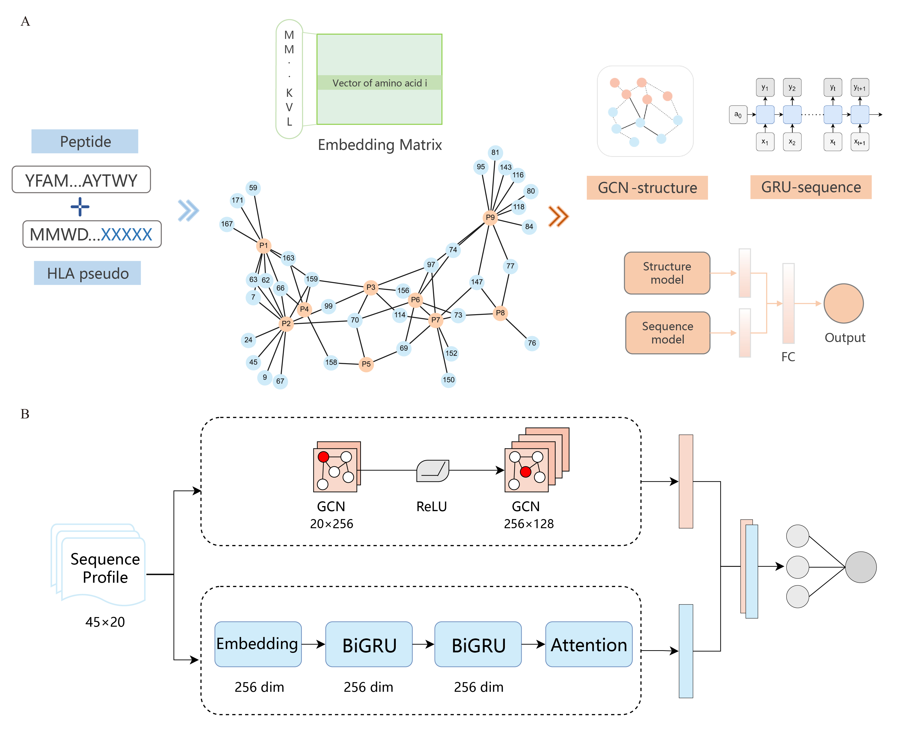

# MultiMHC

MultiMHC is a dual-pathway deep learning framework for peptide–major histocompatibility complex (pMHC) binding prediction that integrates complementary sequential and structural representations.




## Download and Installation

### Get source code
```
git clone https://github.com/zjupgx/multimhc.git
```

### Requirements
It is recommended to use [Conda](https://anaconda.org/channels/anaconda/packages/conda/overview) / [Miniconda](https://www.anaconda.com/docs/getting-started/miniconda/main) to create the environment.
- System: Linux
- Python = 3.8  
- PyTorch = 1.12.0  
- PyTorch Geometric (Pyg) = 2.2.0
- Pytorch Lightning = 1.9.3
- numpy
- pandas
#### Optional Dependencies
- CUDA (MultiMHC was trained and tested with cu102; select the appropriate CUDA version when installing PyTorch and Pyg)
  - Required only for GPU acceleration

## Usage
```
python multimhc.py -i input_file(required) -o [output_file](optional) -d [auto,gpu,cpu]
```
See `python multimhc.py --help` for more information.

#### Examples
```
python multimhc.py -i demo.csv
```
If `-o` is not specified, predictions will be written to a CSV file with an automatically generated timestamp-based filename 
(e.g., `20260101-17_26_00_predictions.csv`).

### Supported Input Format
MultiMHC takes **CSV** file as input with required columns **"peptide"** and **"HLA"**.

- Only MHC class I alleles in the standard format (e.g., `HLA-A*01:01`) are supported.
- Only peptides of length **8–11** are supported, and peptides outside this length range will be filtered out before prediction.

See `demo.csv` for more details
```
peptide,HLA
SFTHPTSF,HLA-A*01:01
ETTFLVDK,HLA-A*01:01
SFVPWQPRF,HLA-B*08:01
PDATSLKY,HLA-A*01:01
GVMKTYRQR,HLA-A*02:01
```